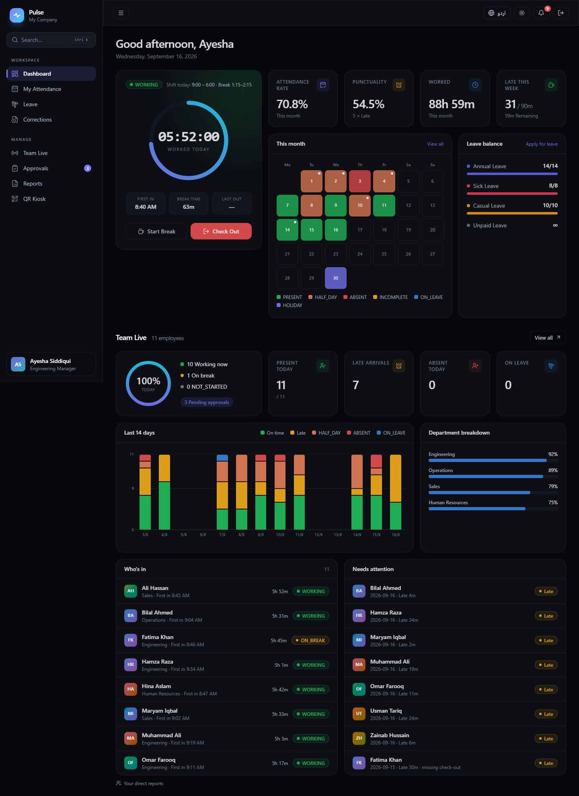
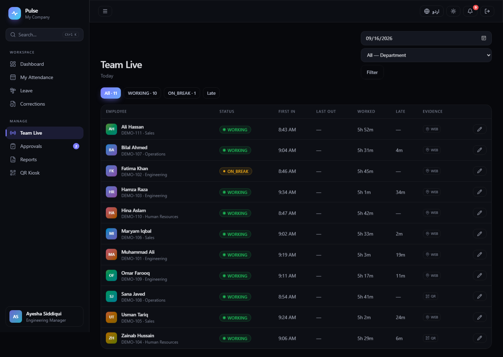
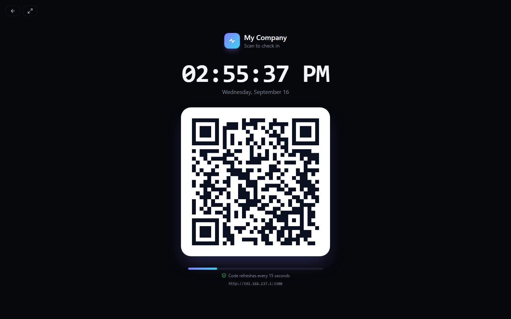
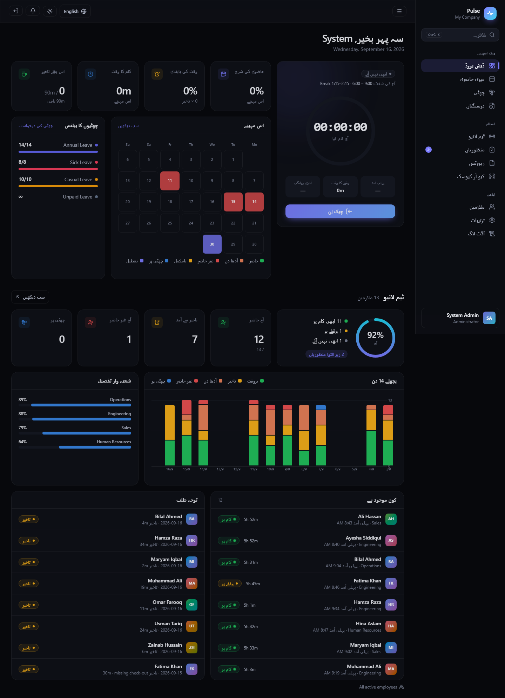

# Pulse Attendance

Self-hosted attendance, leave and time tracking for companies — with a Windows agent that records
attendance automatically when employees log on, lock and shut down their PC.

One Next.js server, one SQLite file. No cloud account, no per-seat pricing, no external database.

[](https://github.com/akashaali22/pulse-attendance/actions/workflows/ci.yml)
[](LICENSE)
[](https://nodejs.org)



## Why

Most small offices either buy a per-seat SaaS or keep a shared Excel sheet that everybody edits.
Pulse is the middle ground: run it on one PC or a small server, and attendance is verified rather
than self-reported — GPS geofence, rotating QR kiosk, optional selfie, a Windows agent, and a
tamper-evident audit log.

## Features

**Attendance**
- Web check-in / check-out with breaks and multiple sessions per day
- GPS geofencing, allowed-IP list, optional selfie
- QR kiosk: an HMAC-signed code that changes every 15 seconds, so a screenshot is useless
- **Windows agent**: logon → check-in, lock beyond the away limit → check-out, shutdown → check-out,
  works offline and syncs later with the original times ([agent/README.md](agent/README.md))

**Rules engine** ([src/lib/engine.ts](src/lib/engine.ts))
- Shifts with start/end times, fixed auto-deducted break, working days, half-day/full-day thresholds
- Late minutes summed per week; over the weekly allowance one leave is deducted automatically,
  and given back if an approved correction brings the week back under the limit
- Half-day leave, holidays, joining dates, early leave, incomplete days
- Everything computed in the company timezone, unit-tested

**People and process**
- Roles: admin, manager (own team only), employee
- Leave types with yearly balances and manager approval
- Correction requests for missed punches; managers can also edit a day directly — originals are
  voided, never deleted
- Notifications, approvals inbox, employee and PC management

**Reporting**
- Live team board, 14-day trend, department rates, month heatmap
- Date-range reports exported to Excel or CSV
- Append-only audit log chained with SHA-256, with a built-in integrity check

**Interface**
- Dark and light themes, English and Urdu (right-to-left), Ctrl+K command palette
- Works on phones, installable as a PWA

| Team live | QR kiosk | Urdu (RTL) |
|---|---|---|
|  |  |  |

## Quick start (local)

Requires **Node.js 24+** (the database uses the built-in `node:sqlite` module).

```bash
git clone https://github.com/akashaali22/pulse-attendance.git
cd pulse-attendance
npm install
npm run dev            # http://localhost:3000
```

Sign in as `admin@company.com` / `Admin@123` and **change that password immediately** — the app
shows a warning until you do.

Optional demo data (1 manager, 11 employees, a month of punches):

```bash
npm run seed:demo      # manager@demo.local / Demo@1234
```

## Deploy

**Try it free (demo, no credit card)**

[](https://render.com/deploy?repo=https://github.com/akashaali22/pulse-attendance)

Render's free plan has no persistent disk and sleeps when idle, so this is a **demo only**:
`DEMO_MODE=1` refills a sample company on every restart. For real use, pick one of the options
below — see [docs/DEPLOY.md](docs/DEPLOY.md) for the full guide.

**Docker (any server or office PC)**

```bash
docker compose up -d   # http://<server-ip>:3000
```

**Fly.io (free allowance, HTTPS included)**

```bash
fly launch --no-deploy --copy-config --name <your-app-name>
fly volumes create pulse_data --size 1 --region sin
fly deploy
```

Serve the app over **HTTPS** if employees will check in from phones — browsers only allow camera
and GPS on HTTPS (or localhost) — and set `COOKIE_SECURE=true`.

Everything lives in the data directory (`./data`, or `/data` in Docker): `attendance.db`,
`password.key` and `selfies/`. **Back up that whole folder**; it is the entire system state.

## The Windows agent

`agent/` is a ~50 KB tray app written in C#. It needs nothing installed on office PCs, because it
builds against the .NET Framework that ships with Windows.

```bash
npm run build:agent    # uses the csc.exe included with Windows
```

Admins download it from **Settings → Desktop agent**; each employee links it once with their email
and password. Details, including how offline periods and clock changes are handled, are in
[agent/README.md](agent/README.md).

## Configuration

| Setting | Where |
|---|---|
| Company name, timezone, allowed networks, weekly late allowance, password visibility | Settings → Company |
| Shifts, break window, grace, thresholds, working days | Settings → Shift |
| Office geofences | Settings → Locations |
| Departments, holidays, leave types | Settings |
| Agent away/offline limits, linked PCs | Settings → Desktop agent |
| `ATTENDANCE_DATA_DIR`, `COOKIE_SECURE`, `TZ` | environment ([.env.example](.env.example)) |

## Security

Read [SECURITY.md](SECURITY.md) before deploying. In short: change the default admin password, serve
over HTTPS, back up the data folder, and decide whether admins should be able to view employee
passwords (Settings → Company; on by default, and it can be turned off permanently).

## Tests

```bash
npm test                                                  # rules engine (unit)
BASE=http://localhost:3000 node scripts/e2e-smoke.mjs     # app end-to-end (uses installed Edge)
BASE=http://localhost:3000 node scripts/password-test.mjs # password visibility rules
BASE=http://localhost:3000 node scripts/agent-api-test.mjs        # agent API incl. offline sync
node scripts/agent-lifecycle-test.mjs --email you@company.com     # real PC test incl. a restart
```

## Known limits

- Overnight shifts (for example 22:00–06:00) are not supported yet
- Selfies are stored as evidence only — there is no face matching or liveness check
- Notifications are in-app only (no email, SMS or WhatsApp yet)
- Browser location and selfie can be faked by a determined user; use the QR kiosk, the desktop
  agent or an IP restriction where that matters
- One server, one SQLite file: good for hundreds of employees, not thousands

## Tech

Next.js 15 (App Router) · TypeScript · Tailwind CSS v4 · `node:sqlite` · bcrypt · ExcelJS · C# agent

## Contributing

Issues and pull requests are welcome — see [CONTRIBUTING.md](CONTRIBUTING.md).

## License

[MIT](LICENSE)
